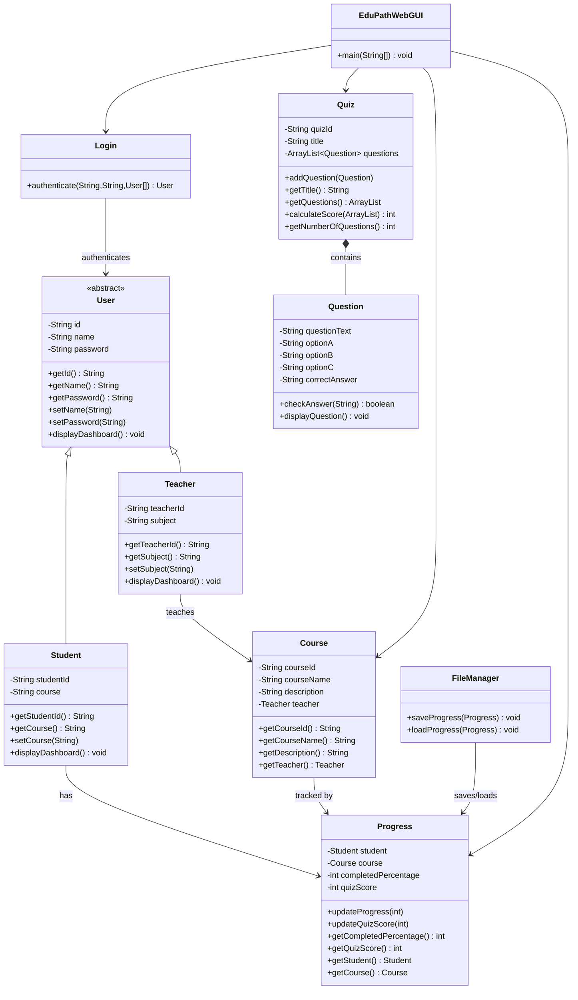

# EduPath - SDG 4 Quality Education

EduPath is a Java Object-Oriented Programming (OOP) educational web application developed to support **Sustainable Development Goal 4 (SDG 4): Quality Education**.

The system provides a simple digital learning environment where students can access course materials, monitor learning progress, complete quizzes, and view their results. Teachers can log in separately to monitor student progress and quiz performance.

The project demonstrates the practical implementation of Object-Oriented Programming concepts including **classes and objects, encapsulation, inheritance, polymorphism, abstraction, association, collections, and file handling**.

---

# Problem Statement

Students need an accessible way to obtain learning materials, assess their understanding, and monitor their learning progress.

At the same time, teachers need a simple method of monitoring students' course completion and assessment results.

Without an integrated learning platform, learning materials, assessments, and student progress may be managed separately, making progress more difficult to monitor.

EduPath addresses this problem by providing a Java-based educational system where students can:

- Access learning materials
- Monitor learning progress
- Complete quizzes
- Receive automatic quiz results

Teachers can:

- View course information
- View student learning progress
- Monitor quiz performance

This system demonstrates how digital technology can support **SDG 4: Quality Education**.

---

# Project Objectives

The objectives of EduPath are:

1. To develop a Java-based educational application using Object-Oriented Programming principles.
2. To provide separate login access for students and teachers.
3. To provide learning materials for students.
4. To allow students to monitor their learning progress.
5. To provide an online quiz with automatic marking.
6. To allow teachers to monitor student progress and quiz performance.
7. To store student progress using Java File I/O.
8. To demonstrate the practical use of OOP concepts in a real-world educational system.

---

# Features

EduPath includes the following features:

- Student login
- Teacher login
- Role-based dashboards
- OOP-based authentication
- Invalid-login handling
- Student information
- Teacher information
- Course information
- Learning materials
- Student progress tracking
- Visual progress bar
- Mark course as completed
- Multiple-choice quiz
- Automatic quiz marking
- Quiz score update
- Teacher monitoring of student performance
- Logout functionality
- File-based data persistence
- Student progress saved to a text file
- Quiz score saved to a text file
- Saved progress restored after application restart

---

# OOP Concepts Used

## 1. Classes and Objects

The application contains several classes representing real-world educational entities.

Main classes include:

- `User`
- `Student`
- `Teacher`
- `Course`
- `Progress`
- `Question`
- `Quiz`
- `Login`
- `FileManager`
- `EduPathWebGUI`

Objects are created from these classes and interact with each other to perform the system functions.

---

## 2. Encapsulation

Private attributes are used to protect object data.

For example, classes such as:

- `User`
- `Student`
- `Teacher`
- `Course`
- `Progress`
- `Question`
- `Quiz`

store their attributes using private access modifiers.

Getter and setter methods are used to access or update data safely.

Example:

```java
private String name;

public String getName() {
    return name;
}

public void setName(String name) {
    this.name = name;
}
```

---

## 3. Inheritance

The application uses inheritance through the `User` class.

`Student` and `Teacher` inherit common attributes and methods from `User`.

```java
public class Student extends User
```

```java
public class Teacher extends User
```

This reduces duplicated code because both student and teacher share common user information such as:

- ID
- Name
- Password

---

## 4. Abstraction

`User` is implemented as an abstract class.

```java
public abstract class User
```

It contains the abstract method:

```java
public abstract void displayDashboard();
```

The abstract class defines common behaviour while allowing subclasses to provide their own implementation.

---

## 5. Polymorphism

The system demonstrates method overriding because both `Student` and `Teacher` implement their own version of:

```java
displayDashboard()
```

The system also demonstrates runtime polymorphism.

Example:

```java
User loginUser = Login.authenticate(
        id,
        password,
        users
);

if (loginUser != null) {
    loginUser.displayDashboard();
}
```

Although `loginUser` is declared as a `User` reference, it can refer to either:

- a `Student` object
- a `Teacher` object

Java automatically executes the correct overridden `displayDashboard()` method depending on the actual object type.

---

## 6. Association

The application contains relationships between different objects.

Examples:

- A `Course` is associated with a `Teacher`.
- A `Progress` object is associated with a `Student`.
- A `Progress` object is associated with a `Course`.
- A `Quiz` contains multiple `Question` objects.

---

## 7. Collections

The application uses Java `ArrayList` to store multiple quiz questions.

Example:

```java
private ArrayList<Question> questions;
```

Questions can be added using:

```java
questions.add(question);
```

The collection allows the quiz system to process multiple questions dynamically.

---

## 8. File Handling and Data Persistence

EduPath uses Java File I/O to store student learning progress.

The `FileManager` class handles saving and loading student progress.

The following Java File I/O classes are used:

- `File`
- `FileReader`
- `FileWriter`
- `BufferedReader`
- `PrintWriter`

Student data is saved in:

```text
data/student_progress.txt
```

Example file content:

```text
U001,100,3
```

The values represent:

```text
Student ID, Course Completion Percentage, Quiz Score
```

Therefore:

```text
U001,100,3
```

means:

- Student ID: `U001`
- Course Completion: `100%`
- Quiz Score: `3`

When the application starts, `FileManager` reads this file and restores the student's saved progress.

Example:

```java
FileManager.loadProgress(progress);
```

When progress or quiz results change, the system saves the new data:

```java
FileManager.saveProgress(progress);
```

This allows student progress to remain available even after the Java application is stopped and restarted.

---

# UML Class Diagram

The following diagram represents the main class relationships in EduPath.



---

# Project Structure

```text
EduPath-SDG4-OOP
│
├── data
│   └── student_progress.txt
│
├── src
│   │
│   ├── gui
│   │   └── EduPathWebGUI.java
│   │
│   ├── model
│   │   ├── Course.java
│   │   ├── Login.java
│   │   ├── Progress.java
│   │   ├── Question.java
│   │   ├── Quiz.java
│   │   ├── Student.java
│   │   ├── Teacher.java
│   │   └── User.java
│   │
│   └── util
│       └── FileManager.java
│
├── .gitignore
└── README.md
```

---

# Class Responsibilities

## User

The abstract parent class for system users.

Stores:

- User ID
- Name
- Password

Defines:

```java
displayDashboard()
```

---

## Student

Represents a student.

Stores:

- Student ID
- Course

The class inherits from `User`.

---

## Teacher

Represents a teacher.

Stores:

- Teacher ID
- Subject

The class inherits from `User`.

---

## Course

Represents a course.

Stores:

- Course ID
- Course name
- Course description
- Teacher

---

## Progress

Tracks student learning performance.

Stores:

- Student
- Course
- Course completion percentage
- Quiz score

---

## Question

Represents one quiz question.

Stores:

- Question text
- Option A
- Option B
- Option C
- Correct answer

It also checks whether the student's answer is correct.

---

## Quiz

Manages the quiz.

Stores:

- Quiz ID
- Quiz title
- Multiple questions

The class uses:

```java
ArrayList<Question>
```

to store quiz questions.

---

## Login

Handles user authentication.

The system checks:

- User ID
- Password

and returns the matching `User` object when authentication is successful.

---

## FileManager

Handles file-based data persistence.

Responsibilities include:

- Saving student progress
- Saving quiz scores
- Reading previously saved progress
- Restoring saved results after application restart

---

## EduPathWebGUI

Provides the browser-based user interface.

It handles:

- Login
- Student Dashboard
- Teacher Dashboard
- Course Content
- Learning Materials
- Quiz
- Quiz Result
- Progress Updates
- Invalid Login
- Logout

---

# Demo Accounts

## Student

```text
User ID: U001
Password: password
```

## Teacher

```text
User ID: T001
Password: 12345
```

---

# Student Functions

After successful login, a student can:

1. View student information.
2. View course information.
3. View teacher information.
4. View learning materials.
5. Monitor learning progress.
6. View a progress bar.
7. Mark the course as completed.
8. Take the Java Basics Quiz.
9. Submit quiz answers.
10. Receive automatic quiz marking.
11. View the quiz result.
12. View the updated quiz score.
13. Save progress automatically.
14. Restore previous progress after restarting the program.
15. Logout.

---

# Teacher Functions

After successful login, a teacher can:

1. View teacher information.
2. View subject information.
3. View course information.
4. View course description.
5. View quiz information.
6. View number of quiz questions.
7. View student information.
8. Monitor student course progress.
9. View student quiz results.
10. Logout.

---

# Quiz System

EduPath contains a **Java Basics Quiz**.

The quiz currently contains three questions.

Topics include:

- Object-Oriented Programming
- Java programming language
- Java object creation

Each question contains three answer options:

```text
A
B
C
```

The application automatically calculates the student's score.

Example:

```text
Quiz Score: 3 / 3
```

The updated quiz result is displayed on:

- Student Dashboard
- Teacher Dashboard

The result is also saved to the progress file.

---

# Course Content

The current Java Programming course contains learning materials covering:

## Introduction to Java

- What is Java?
- Java applications
- Basic Java syntax

## Object-Oriented Programming

- Classes and Objects
- Encapsulation
- Inheritance
- Polymorphism

Students can mark the course as completed after reviewing the learning materials.

---

# Data Persistence Process

The persistence workflow is:

```text
Student completes activity
        |
        v
Progress object updated
        |
        v
FileManager.saveProgress()
        |
        v
data/student_progress.txt
        |
        v
Application stopped
        |
        v
Application restarted
        |
        v
FileManager.loadProgress()
        |
        v
Previous progress restored
```

For example, after completing the course and quiz:

```text
U001,100,3
```

is stored.

When the application restarts, the terminal displays:

```text
Progress loaded successfully.
```

The Student Dashboard then continues to display:

```text
Learning Progress: 100%
Quiz Score: 3 / 3
```

without requiring the student to retake the quiz.

---

# How to Compile

Open the terminal from the project root directory.

Compile the project using:

```bash
javac -cp src src/model/*.java src/util/FileManager.java src/gui/EduPathWebGUI.java
```

If no errors appear, the compilation is successful.

---

# How to Run

Run:

```bash
java -cp src gui.EduPathWebGUI
```

The terminal should display:

```text
Progress loaded successfully.
EduPath website running at http://localhost:8080
```

If no previous progress file exists, it may display:

```text
No saved progress found. Using default values.
EduPath website running at http://localhost:8080
```

When using GitHub Codespaces, open forwarded **Port 8080** to access the application in the browser.

---

# System Workflow

```text
                         Login
                           |
              +------------+------------+
              |                         |
           Student                    Teacher
              |                         |
              v                         v
     Student Dashboard         Teacher Dashboard
              |                         |
              |                  View Student
              |                  Performance
              |
       +------+------+
       |             |
       v             v
Course Content     Take Quiz
       |             |
       v             v
Learning         Answer Questions
Materials            |
       |             v
       v        Automatic Marking
Mark Complete        |
       |             v
       v          Quiz Result
Progress = 100%      |
       |             |
       +------+------+
              |
              v
        FileManager
              |
              v
student_progress.txt
```

---

# Testing

The following functions were tested successfully.

| Test Case | Input / Action | Expected Result | Status |
|---|---|---|---|
| Student Login | `U001 / password` | Student Dashboard displayed | PASS |
| Teacher Login | `T001 / 12345` | Teacher Dashboard displayed | PASS |
| Invalid Login | Incorrect credentials | Login Failed message | PASS |
| View Course | Open course content | Learning materials displayed | PASS |
| Mark Course Complete | Click completion button | Progress becomes 100% | PASS |
| Open Quiz | Click Take Quiz | Three questions displayed | PASS |
| Correct Quiz Answers | A, B, A | Score becomes 3/3 | PASS |
| Automatic Marking | Submit quiz | Score calculated automatically | PASS |
| Student Result | Return to dashboard | 3/3 displayed | PASS |
| Teacher Monitoring | Teacher login | 100% and 3/3 displayed | PASS |
| File Saving | Complete course and quiz | Progress file created | PASS |
| File Loading | Restart application | Previous progress restored | PASS |
| Logout | Click logout | Return to login page | PASS |

---

# File Persistence Testing

After completing the quiz and course, the following command was used:

```bash
cat data/student_progress.txt
```

The output was:

```text
U001,100,3
```

After restarting the Java application:

```bash
java -cp src gui.EduPathWebGUI
```

the terminal displayed:

```text
Progress loaded successfully.
```

This confirms that student progress is successfully stored and restored using Java File I/O.

---

# SDG 4 Contribution

EduPath supports **Sustainable Development Goal 4: Quality Education** by demonstrating how digital technology can provide:

- Accessible learning materials
- Digital course content
- Student learning progress monitoring
- Online assessments
- Automatic assessment feedback
- Persistent student learning records
- Teacher monitoring of student performance

The project demonstrates how a simple educational software system can support structured and accessible learning.

---

# Technologies Used

- Java
- Object-Oriented Programming
- Java Collections
- ArrayList
- Java HTTP Server
- Java File I/O
- File
- FileReader
- FileWriter
- BufferedReader
- PrintWriter
- HTML
- CSS
- Git
- GitHub
- GitHub Codespaces
- Visual Studio Code

---

# Limitations

The current version of EduPath has several limitations:

1. The system currently contains one student account.
2. The system currently contains one teacher account.
3. Only one Java course is available.
4. The quiz currently contains three questions.
5. Data is stored using a simple text file.
6. The system does not currently use a database.
7. Login credentials are currently stored directly in the Java application.
8. Learning materials are currently static.
9. The teacher cannot currently add new courses or quiz questions through the web interface.

---

# Future Improvements

Future versions of EduPath could include:

- Multiple students
- Multiple teachers
- Multiple courses
- Student registration
- Database integration
- Password hashing
- Session-based authentication
- Teacher course management
- Teacher quiz creation
- More learning materials
- More quiz questions
- Individual progress files for multiple students
- Grades and assessment history
- Responsive mobile interface
- Improved accessibility
- Administrative dashboard

---

# Conclusion

EduPath demonstrates the implementation of Object-Oriented Programming concepts in a functional educational web application.

The project applies:

- Classes and Objects
- Encapsulation
- Inheritance
- Abstraction
- Polymorphism
- Association
- Collections
- File Handling
- Data Persistence

The application provides student and teacher authentication, learning materials, course progress tracking, quizzes, automatic marking, teacher monitoring, and persistent student results.

The system supports **SDG 4: Quality Education** by demonstrating how a digital platform can support learning, assessment, progress monitoring, and access to educational resources.

---

# GitHub Repository

Project source code:

```text
https://github.com/alexfaruk86-star/EduPath-SDG4-OOP
```

---

# Author / Group Information

Add your group information before final submission:

```text
Full Name:
Student ID:
Class Code:
Programme:
NRIC / Passport:
```

Repeat the information above for every group member.